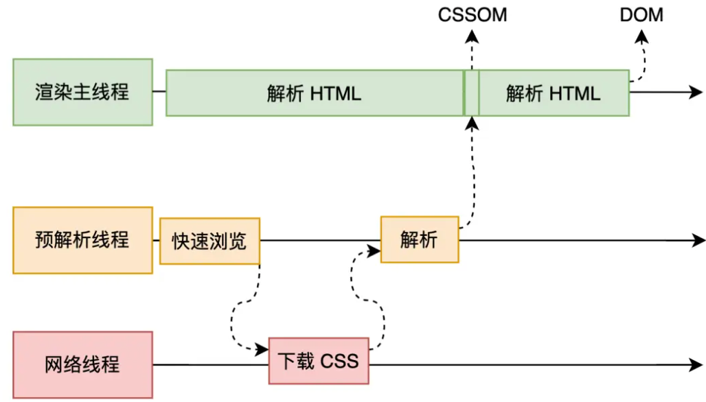
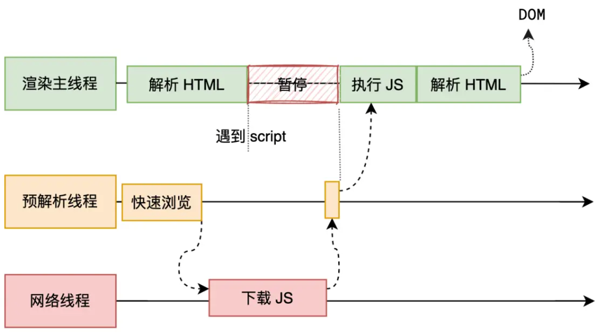

# 浏览器

## 浏览器渲染原理

浏览器的渲染是从接收到服务器响应的资源开始处理的，以下面的代码为例，从浏览器接收到资源（html文件）到屏幕显示出来一个带有 h1 样式的 hello world，这里面浏览器所做的处理其实就是渲染。

```html
<!-- ... -->
<h1>hello world</h1>
<!-- ... -->
```

整个渲染的流程包括了：html 解析、样式计算、布局、分层、绘制、合成（分块、光栅化、画）

### HTML 解析

简单来说就是，HTML 字符串经过处理，可以被处理成 DOM 树和 CSSOM 树，浏览器提供给 JS 操作这两棵树的能力。

HTML 具体被编译成 DOM 树，最开始会先对 HTML 代码做词法分析，分成多个 token（标记），根据这些 token 去构造出一棵 DOM 树。

**没去了解过浏览器是怎么具体对 HTML 做词法分析的，但是我在 Vue.js 设计与实现中看到过 Vue 的解析器是怎么将模版语法解析成虚拟 DOM，我觉得应该是类似的**
其实，其中用到了一个叫状态机的算法，其实是一种状态模式的体现，在这种模式下，会自动切换满足不同条件的不同的状态，只能指定初始态，对于状态机运行过程中，外部无法再指定状态。

简单讲下状态机是怎么对模版语法进行语法分析并分析出多个 token 的，以上面 hello world 的代码为例：

最开始的状态机会是一个初始状态，然后输入一串字符串 `<h1>hello world</h1>`，对每个字符做处理，当遇到 `<` 时做xxx操作，当已经遇到 `<` 之后又遇到字母做xxx操作，当遇到 `>` 做xxx操作，简单来说就是状态的切换配合一些特定的操作，可以去看《Vue.js 设计与实现》里面讲得很详细。

当然，在解析 HTML 代码的过程中，也会遇到 CSS 和 JS，对于两种情况也有不一样的处理：

- CSS：

  一般主线程在解析 HTML 代码时，解析到 `link` 标签的话，如果此时外部 CSS 文件还没下载解析好，主线程不会等待，而会继续解析后续的 HTML 代码。因为下载和解析 CSS 是在预解析线程中进行的，在解析完之后，会把结果（CSSOM 树）返回给主线程。

  

- JS：

  解析到 `script` 标签的时候，默认情况下，会停止解析 HTML 代码，等待 JS 文件下载，然后解析并执行代码，才会继续解析 HTML。
  因为 JS 拥有操作 DOM 的能力，所以 DOM 树的生成需要暂停。

  当然，`script` 标签里面有两个属性 `async` 和 `defer` 可以控制对应外部 JS 文件的执行时间，这两个属性都会使 JS 文件异步下载：
  - `async` 会在 JS 文件下载完成之后，停止解析 HTML 代码，马上解析执行 JS 代码
  - `defer` 则是 JS 文件下载完成之后，不立即执行，如果还有 HTML 代码未解析完成，会等待其解析完再解析执行 JS 代码

  

### 样式计算