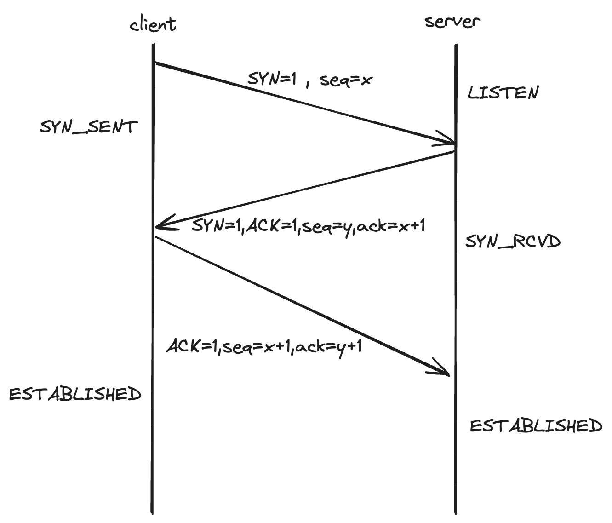
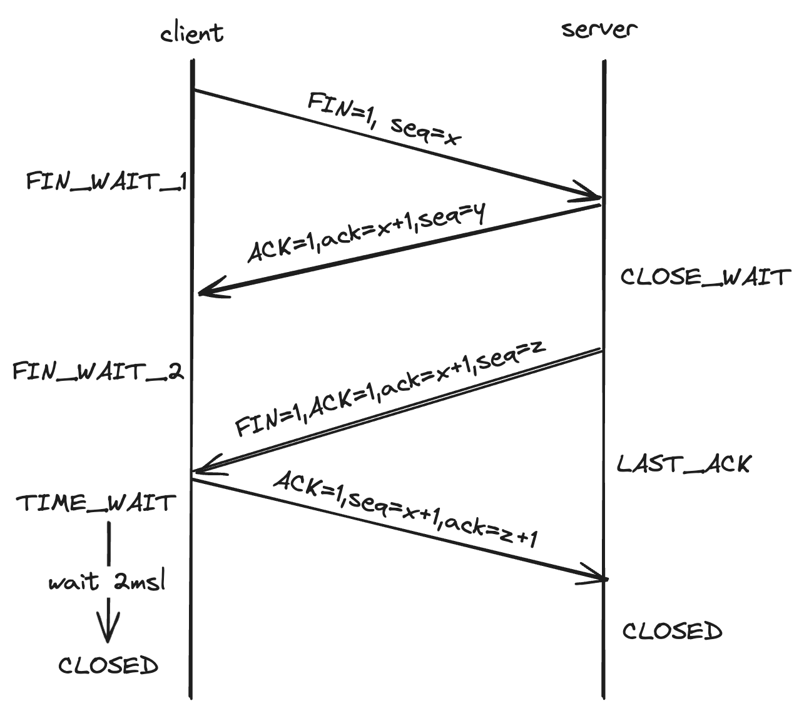
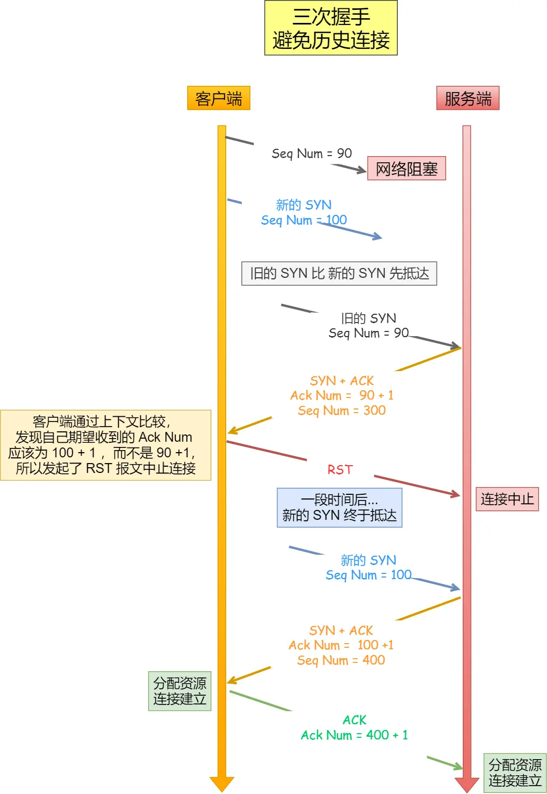
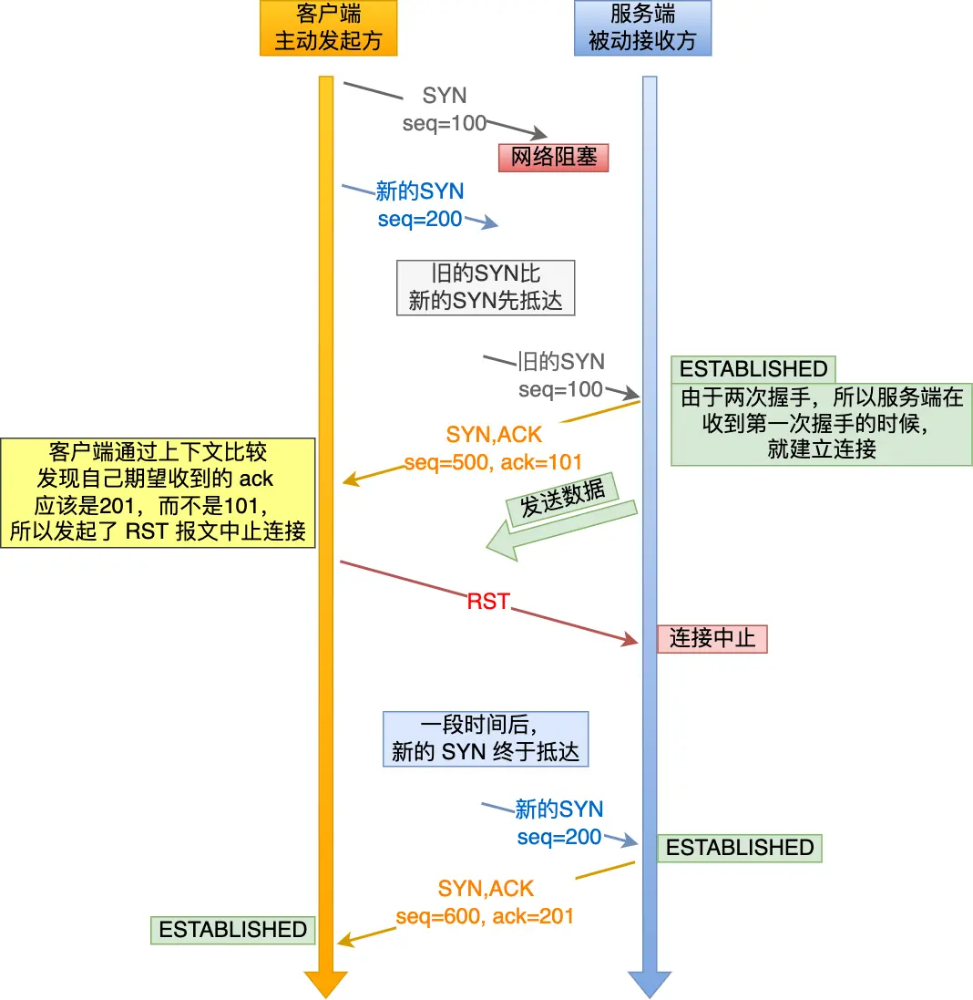
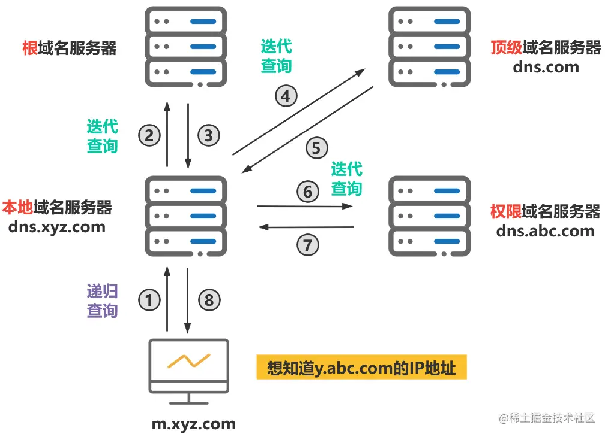

# 计网

## http 发展

- 0.9（极其简陋，hello world阶段）——MDN锐评（单行协议）

  请求：GET是0.9版本的http的唯一可用方法，其后跟目标资源的路径
  ```javascript
  GET /page.html
  ```
  响应（only html）：只包含响应文档本身，只有html文件可以传送，不包含http头，无法传输其他类型的文件，也没有状态码
  ```javascript
  <html>
    这是一个非常简单的 HTML 页面
  </html>

  ```
- 1.0（主要加了header）——MDN锐评（构建可扩展性）

  创新点：
  - 协议版本信息会跟随GET行发送
  - 追加状态码
  - 引入http header，允许传输元数据
  - 凭借Content-Type使得可以传输除html以外的其他格式文件
  ```javascript
  GET /mypage.html HTTP/1.0
  User-Agent: NCSA_Mosaic/2.0 (Windows 3.1)

  200 OK
  Date: Tue, 15 Nov 1994 08:12:31 GMT
  Server: CERN/3.0 libwww/2.17
  Content-Type: text/html
  <HTML>
  一个包含图片的页面
    
  </HTML>

  ```
- 1.1（逐渐完善）——MDN锐评（标准化的协议）

  创新点：
  - 连接可复用，减少三握四挥的次数，节省资源
  - 允许连续发送多个请求，而不用等待前一次请求的响应
  - 响应分块
  - 增强缓存控制机制，引入`Cache-Control` 提供更细粒度的缓存策略控制，引入`max-age` 控制资源的最大生存时间，`must-revalidate` 是否需要重新验证，优化资源重用
  - 引入内容协商机制
    缺点：
  - 队头阻塞：连续发多个请求，但是如果服务器响应第一个请求的时间需要很久，就会造成响应的队头阻塞
  - 报文信息
    ```http
    GET /zh-CN/docs/Glossary/Simple_header HTTP/1.1
    Host: developer.mozilla.org
    User-Agent: Mozilla/5.0 (Macintosh; Intel Mac OS X 10.9; rv:50.0) Gecko/20100101 Firefox/50.0
    Accept: text/html,application/xhtml+xml,application/xml;q=0.9,*/*;q=0.8
    Accept-Language: en-US,en;q=0.5
    Accept-Encoding: gzip, deflate, br
    Referer: https://developer.mozilla.org/zh-CN/docs/Glossary/Simple_header

    200 OK
    Connection: Keep-Alive
    Content-Encoding: gzip
    Content-Type: text/html; charset=utf-8
    Date: Wed, 20 Jul 2016 10:55:30 GMT
    Etag: "547fa7e369ef56031dd3bff2ace9fc0832eb251a"
    Keep-Alive: timeout=5, max=1000
    Last-Modified: Tue, 19 Jul 2016 00:59:33 GMT
    Server: Apache
    Transfer-Encoding: chunked
    Vary: Cookie, Accept-Encoding

    (content)


    GET /static/img/header-background.png HTTP/1.1
    Host: developer.mozilla.org
    User-Agent: Mozilla/5.0 (Macintosh; Intel Mac OS X 10.9; rv:50.0) Gecko/20100101 Firefox/50.0
    Accept: */*
    Accept-Language: en-US,en;q=0.5
    Accept-Encoding: gzip, deflate, br
    Referer: https://developer.mozilla.org/zh-CN/docs/Glossary/Simple_header

    200 OK
    Age: 9578461
    Cache-Control: public, max-age=315360000
    Connection: keep-alive
    Content-Length: 3077
    Content-Type: image/png
    Date: Thu, 31 Mar 2016 13:34:46 GMT
    Last-Modified: Wed, 21 Oct 2015 18:27:50 GMT
    Server: Apache

    (image content of 3077 bytes)

    ```
- 2.0（优化并发）
  - 通过多路复用技术，解决队头阻塞的问题
  - header压缩
  - 二进制格式
  - 服务器推送机制
- 3.0（TCP改QUIC）
  - 基于udp的quic协议（quick udp internet connections）


## http 缓存技术

1. 强缓存

   强缓存不会向服务器发送请求，直接从缓存中读取资源
   - 通过两种http响应头来实现
     - Expires
       - 1.0中的规范，表示资源到期时间，请求时间小于Expires时间，直接使用缓存资源
     - Cache-Control
       - 1.1中的规范，优先级高于Expires，常见指令包括`max-age` （资源最大有效时间）、`no-cache` （每次都向服务器验证数据的有效性，返回304 NotModified则可以直接使用缓存的数据，返回200则说明使用新数据）、`no-store` （完全不缓存）
2. 协商缓存

   在使用缓存的数据之前，先向服务器查验一下缓存数据的有效性，如果依然有效则可以直接使用，如果失效则重新请求一份新的数据
   - 通过两种http响应头来实现
     1. Last-Modified、If-Modified-Since
        - 浏览器第一次请求某个资源的时候，服务器会在响应头里面包含一个Last-Modified的标头，表示该资源最后被修改的时间，浏览器收到这个资源后，会将资源连同Last-Modified标头一起缓存
        - 当浏览器再次需要请求这个资源的时候，会在请求头里面包含一个If-Modified-Since的标头，值为Last-Modified中的时间
        - 服务器在接收到请求后，比较该资源的最后修改时间和If-Modified-Since的值
          - 如果资源没有被修改，则返回304 Not Modified，浏览器可以直接使用缓存的资源
          - 如果资源已经被修改，服务器会返回新的资源，同时更新Last-Modified的内容
     2. E-Tag、If-None-Match
        - 与Last-Modified、If-Modified-Since类似，不过E-Tag保存的是hash值
        - 再次请求资源，请求会把If-None-Match带上，值为E-Tag
        - 服务器匹配的也是hash值，匹配就304，不匹配就200直接更新资源和E-Tag值


## tcp 三握



1. 双方最初都处于CLOSED的状态
2. client随机初始化一个序号client\_isn(client\_initial sequence number 即 x)，同时将SYN置为1，向服务端发送一个SYN报文，client状态改为SYN\_SENT
3. server接收到client发过来的SYN报文后，server也会随机初始化一个序号server\_isn(即 y)，同时将ACK和SYN置1，将ack（确认应答号）设置为client\_isn + 1，向client响应一个应答报文，server状态修改为SYN\_RCVD
4. client在接收到server的应答报文之后，还需要向server回应一个最后的应答报文，将ACK置1，将ack（确认应答号）设置为server\_isn + 1，最后将报文发送给server

**注意：**

在最后一次握手时，是可以携带client到server的数据的，但是在前两次是不行的


## tcp 四挥



1. 最初双方都处于ESTABLISHED状态
2. client主动发送一个结束连接的报文，并且停止发送数据，报文首部包含标志位FIN=1，序列号seq=x，client会进入FIN WAIT 1状态
3. server接收到结束连接的报文，会响应一个确认报文，标志位ACK=1，应答序列号ack=x+1，并且附上自己的序列号seq=y，server会进入CLOSE WAIT（半关闭）阶段，tcp服务器会通知高层的应用进程，“此时client已经没有数据发送了，应用进程你看一下还需要发送数据吗，如果还要发送的话，我先帮你发完再下班”
4. client收到确认报文之后，会进入FIN WAIT 2阶段，等待server将确认结束连接的报文发送过来，在这个状态还能接受服务器发送的最后的数据
5. 等server将最后的数据发送完毕，就会向client发送确认结束连接的报文，标志位FIN=1，ACK=1，序列号seq=z，应答序列号ack=x+1，此时client进入LAST ACK（最终确认）状态，等待client的确认
6. client在接收到server确认结束连接的报文后，会响应一个最终的确认报文，标志位ACK=1，序列号seq=x+1，应答序列号ack=z+1，此时client会进入TIME WAIT阶段，需要再等待2MSL的时间后再进入CLOSED状态
7. server只要接收到client的最终结束报文就会立即进入CLOSED状态


## 为什么四挥要等待2MSL

MSL——Maximum Segment Lifetime（最大报文寿命）

tcp允许设置不同的msl

原因：

1. 确保client发送的最后一个ACK报文能够到达server

   如果最后一挥的ACK报文丢失了，那么站在server的角度看，已经发送了一个FIN+ACK的报文请求结束连接，但是client还没给我回应，是不是发送的报文client没收到，于是server会重发一个FIN+ACK的报文再次请求结束连接，那么client就可以在2msl的时间内收到这个再次发送的报文，并且再次响应这个报文并重新开始计时
2. 处理迟到的数据包

   网络延迟可能导致报文在网络中滞留超过预期的时间。等待2MSL确保了在连接关闭前，网络中所有旧的重复数据包都会因超时而被丢弃。
3. 允许TCP连接可靠终止

   连接双方都明确知道连接已经被正常关闭，等待2msl是对连接能否正常关闭的最后确认


## 为什么需要四挥

在结束连接的过程中，client向server发送`FIN` ，会进入一个停止发送数据，但还能接收数据的状态

在server收到`FIN` 后，会先向client发送`ACK` 表示收到了`FIN` 报文，但是server可能还有未处理完的数据需要先处理完，

等server已经将数据处理完之后，会再向client发送`FIN` 表示同意结束连接

然后client再发送`ACK`来响应这个`FIN` 报文


## 为什么需要三次握手？不是两次、四次？

1. 避免历史连接的初始化（防止已失效的请求报文突然又传送到server）——针对二握
2. 同步双方的初始序列号——针对二握
3. 避免资源浪费——针对四握





三握避免历史连接初始化场景：

1. client先发了一个seq=90的SYN报文，由于网络问题阻塞了，一直无响应，又重新发了一个新的seq=100的SYN报文
2. 此时，如果旧的SYN（历史连接）比新的SYN先到达，server会根据接收到的seq回复一个SYN+ACK的报文，包含ack=90+1，seq=300
3. client在接受到回复之后，跟上下文比较，client期望收到的是，新的SYN的回复（即ack=100+1）而不是历史连接的回复（ack=90+1），所以会终止报文

如果是二握，在server收到第一次握手的时候就已经建立连接，虽然在client收到server的响应报文后会发现问题终止连接，但是还是会造成资源的浪费


## DNS解析



以`www.baidu.com` 为例，其实完全体是`www.baidu.com.` ，最后的`.` 是根域名，`.com` 是顶级域名，`baidu.com` 是权限域名

同样的，以百度为例，DNS的解析过程分为两种查询过程：

1. 递归查询
   1. 先查找浏览器的DNS缓存，如果找到，ip地址直接用来建立连接，结束查询
   2. 在浏览器DNS缓存中查找不到对应ip地址，会去操作系统中查找，如果找到，同样也会直接建立连接，结束查询
   3. 在操作系统的Hosts找不到对应ip地址，操作系统会向本地域名服务器发起请求，如果找到会返回ip地址，找不到则会代表用户进行迭代查询
2. 迭代查询
   1. 本地域名服务器会先查询根域名服务器，获取顶级域名服务器的地址
   2. 在本地域名服务器获取顶级域名服务器的地址后，直接向顶级域名服务器发起查询，获取权限域名服务器的地址
   3. 在本地域名服务器获取权限域名服务器的地址后，直接向权限域名服务器发起查询，获取最终ip地址

本地域名服务器获得最终ip地址后，将其返回给操作系统，操作系统在返回给浏览器，浏览器凭借ip地址与目标服务器建立连接

**注意**：DNS解析可以用纯递归查询，只不过很消耗域名服务器的资源，加重其负担，所以本地域名服务器往根、顶级、权限域名服务器查询采用迭代查询


## 输入url之后发生了什么？

1. 解析url，提取协议、域名、路径等信息
2. DNS解析，将域名解析为对应的IP地址
3. 浏览器与服务器进行TCP3次握手，建立连接
4. 如果是https协议的话，在三握之后，会进行SSL/TLS握手，然后开始发送http请求；如果只是http协议就可以直接开始发送请求了
5. 服务器接到请求后，开始处理并响应数据
6. 浏览器在收到响应数据之后，解析数据，根据状态码判断是否成功
7. 响应成功之后，浏览器开始解析渲染
   1. 将html解析成DOM Tree，css解析成CSSOM Tree，两者合并生成Render Tree
   2. 布局、分层
8. 连接结束，TCP四挥结束连接